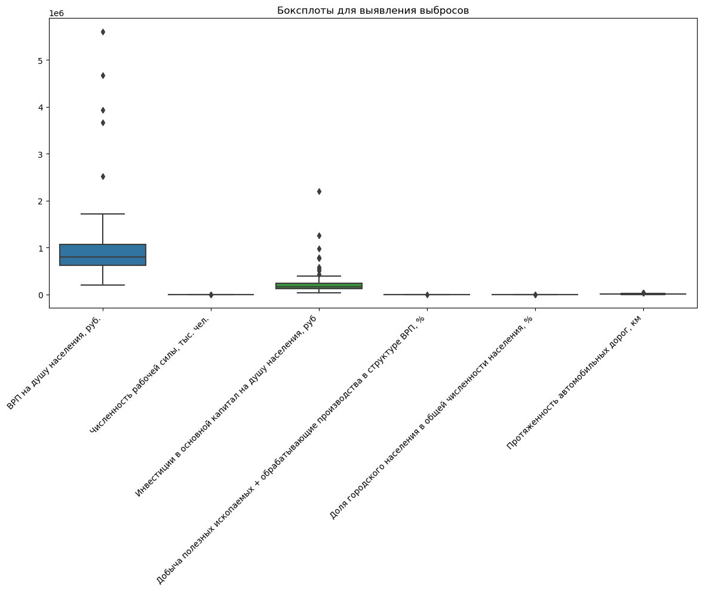
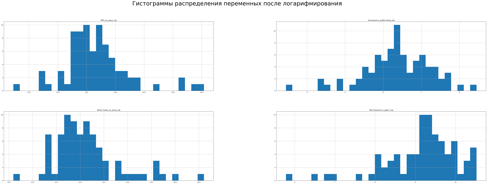
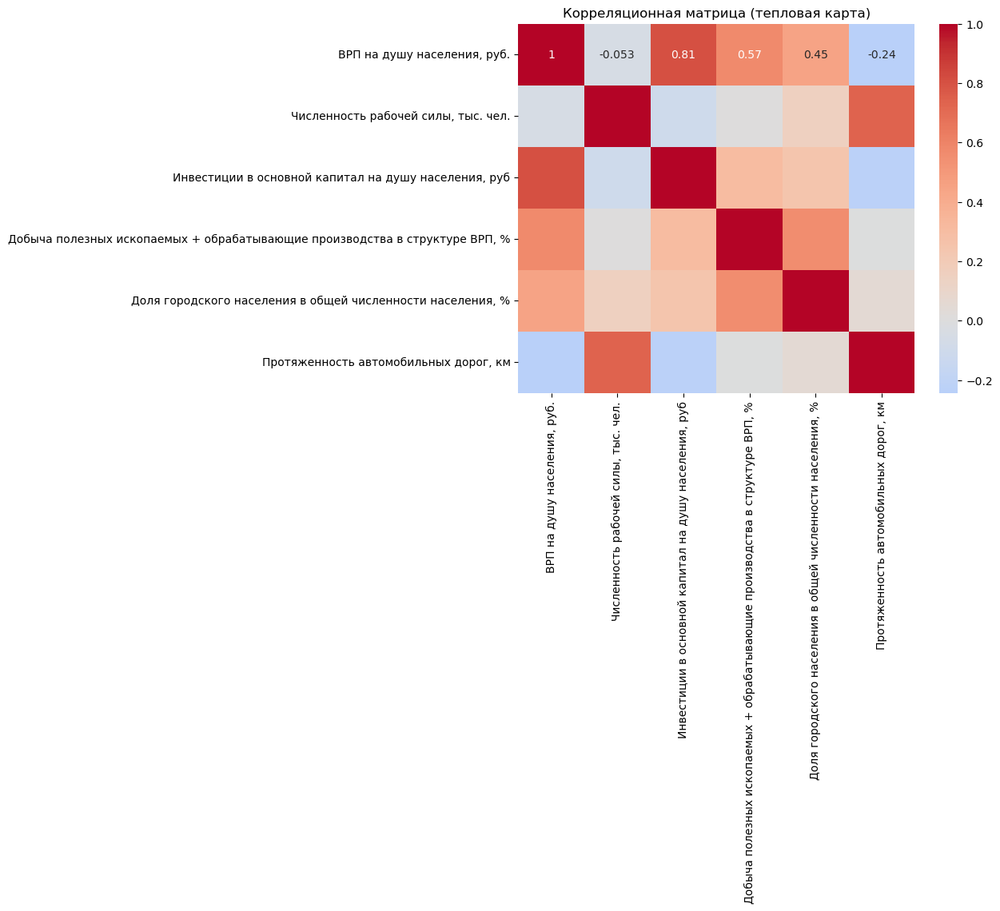

# russia-grp-econometric-analysis
# Инвестиции в основной капитал и ВРП регионов России

Учебный эконометрический проект о том, насколько инвестиции в основной капитал объясняют разброс ВРП на душу населения между регионами России. Казалось бы, тут нечего проверять — первый семинар по макре, Y = C + G + I + NX, инвестиции растут — растёт и ВРП. Но часть зарубежной литературы находит эффект инвестиций в инфраструктуру незначимым или даже отрицательным, и одна из вероятных причин — эндогенность: инвестиции далеко не всегда экзогенный фактор, а зачастую сами являются следствием того же ВРП, который должны объяснять. Весь проект построен вокруг этой проблемы: сначала честная OLS-оценка, потом её проверка на эндогенность и переход на 2SLS с инструментальной переменной.

Данные — 85 регионов РФ за 2024 год (без ДНР, ЛНР, Запорожской и Херсонской областей — по ним нет сопоставимой статистики Росстата), после чистки в модели остаётся 80.

## Гипотеза

H0: β1 ≤ 0
H1: β1 > 0, где β1 — коэффициент при логарифме инвестиций на душу населения.

Опираясь на производственную функцию Кобба-Дугласа и несколько российских работ по региональной экономике, ожидалось, что инвестиции всё-таки положительно и значимо влияют на ВРП — вопрос был в том, как оценить это без смещения.

## Данные

Источник — открытая статистика Росстата за 2024 год. По каждому региону собраны:

- ВРП на душу населения, руб.
- Численность рабочей силы, тыс. чел.
- Инвестиции в основной капитал на душу населения, руб.
- Доля добычи полезных ископаемых и обрабатывающих производств в структуре ВРП, %
- Доля городского населения, %
- Протяжённость автомобильных дорог, км — в основную модель эта переменная напрямую не идёт, она нужна как инструмент для инвестиций (см. ниже)

### Пропуски и выбросы

Сырые данные из Росстата выгружены в формате, удобном для чтения: пробел вместо разделителя тысяч (1 015 794), запятая вместо точки, знак процента прямо внутри ячейки. Всё это прогоняется через `str.replace` (убираются пробелы, запятые меняются на точки, `%` вырезается), а затем через `pd.to_numeric(errors='coerce')` — так всё, что не преобразовалось в число, сразу становится видимым NaN.

После этого — 3 пропуска, и все по протяжённости дорог: у Москвы, Санкт-Петербурга и Севастополя такой статистики нет ни у Росстата, ни в других открытых источниках. Удобное совпадение — у городов федерального значения и структура ВРП принципиально другая (в основном сфера услуг, а не добыча и обработка), так что их всё равно пришлось бы чистить как выбросы чуть позже. 85 → 82 наблюдения.

Дальше — боксплоты. Ненецкий и Ямало-Ненецкий АО вылетают за пределы графика по ВРП на душу населения (14.25 и 12.2 млн руб. против медианы в районе 800 тыс.) — маленькое население, да и огромная добывающая промышленность. Это реальные регионы, не ошибка в данных, но для линейной модели такие два наблюдения — грозят утянуть коэффициенты за собой. Убраны как выбросы. Итог — 80 наблюдений.



### Логарифмирование

ВРП на душу, численность рабочей силы, инвестиции на душу и протяжённость дорог сильно скошены вправо — медиана заметно ниже среднего, типичная картина для показателей вида «чем крупнее регион, тем непропорционально больше значение». Прологарифмированы через `log1p` (хотя нулевых значений в выборке в итоге не оказалось, это скорее стандартная подстраховка). После логарифмирования распределения куда ближе к нормальному, и заодно коэффициенты модели превращаются в эластичности — то, что нужно для интерпретации «на сколько % вырастет ВРП при росте инвестиций на 1%». Доли (городское население, добыча и обработка) оставлены как есть — они и так ограничены диапазоном 0–100.



## Разведочный анализ: корреляции и мультиколлинеарность

Из корреляционной матрицы сильнее всего бросается в глаза связь ВРП на душу и инвестиций на душу (0.81) — и это как раз главный подозреваемый на эндогенность, о которой ниже. Ещё заметна корреляция дорог и численности рабочей силы (0.74): чем больше в регионе людей, тем обычно больше и дорожной сети — связь скорее географическая, чем причинная.



Отдельно проверен VIF по регрессорам основной модели — максимум 1.59 (у константы VIF большой, но это ожидаемо, она не центрирована и не считается). При обычном пороге мультиколлинеарности в 10 вопросов тут нет: регрессоры не дублируют друг друга, а высокая корреляция инвестиций с ВРП — это не мультиколлинеарность, а именно повод разбираться с эндогенностью.

## Модель

```
log(ВРП_на_душуᵢ) = β0 + β1·log(инвестицииᵢ) + β2·log(раб_силаᵢ) + β3·доля_добычи_обработкиᵢ + β4·доля_гор_населенияᵢ + εᵢ
```

## Почему обычный OLS тут не работает

Инвестиции в основной капитал — классический пример эндогенного регрессора. Причинность может идти в обе стороны: регионы с более высоким ВРП объективно могут больше инвестировать (больше свободных средств, выше инвестиционная привлекательность), а не только инвестиции поднимают ВРП. К тому же есть ненаблюдаемые факторы — качество институтов, деловой климат, эффективность регионального управления — которые одновременно тянут вверх и инвестиции, и ВРП. Если это игнорировать, OLS-оценка коэффициента при инвестициях будет смещена, и заранее не ясно, в какую сторону.

OLS всё равно оценивается — как база для сравнения. Коэффициент при логарифме инвестиций получился 0.5241, значим на уровне 1%. R² = 0.869, F = 124.46. Доля добычи/обработки и доля городского населения тоже значимы на 1%, с коэффициентами около 0.009–0.01.

## 2SLS и инструментальная переменная

В качестве инструмента для инвестиций взята протяжённость автомобильных дорог. Логика простая: сами по себе километры асфальта не создают добавленную стоимость напрямую, но это инфраструктурное условие, при котором инвестиции становятся выгоднее и вероятнее. К тому же дорожная сеть во многом наследие ещё советских лет — то есть исторически предопределена и слабо реагирует на текущий уровень ВРП. Это содержательный аргумент, а не строгое доказательство: при точной идентификации (один инструмент на одну эндогенную переменную) формально проверить экзогенность нечем, см. раздел про ограничения.

Процедура — классический IV2SLS (`linearmodels.iv.IV2SLS`).

**Первый этап**: log(инвестиций) регрессируется на инструмент (log длины дорог) и все экзогенные контрольные переменные. Коэффициент при инструменте отрицательный и значим на 1% (-0.4539, t = -3.43) — сам знак тут не так важен, важно, что связь сильная и статистически надёжная.

**Второй этап**: в основную модель ВРП вместо фактических инвестиций подставляются предсказанные значения с первого этапа.

| | OLS | 2SLS | 2SLS (робастные s.e.) |
|---|---|---|---|
| β (log инвестиций) | 0.5241*** | 0.7571*** | 0.7571*** |
| R² | 0.869 | 0.806 | 0.806 |
| F | 124.46*** | 262.42*** | 275.82*** |
| N | 80 | 80 | 80 |

Коэффициент при инвестициях вырос с 0.52 до 0.7571 и остался значим на 1% (t = 5.93). То, что 2SLS-оценка оказалась выше OLS, вполне ожидаемо, если смещение от эндогенности занижает истинный эффект — например, из-за реверсивной причинности, которая размывает связь в обычном МНК. Остальные регрессоры (рабочая сила, доля добычи, городское население) на втором этапе теряют часть значимости — ожидаемо, раз они участвовали в предсказании эндогенной переменной на первом этапе. R² второго этапа (0.806) ниже, чем у OLS (0.869), но напрямую их сравнивать некорректно: на втором этапе используются предсказанные, а не фактические инвестиции.

## Тесты

**Релевантность инструмента.** H0: инструмент не связан с эндогенной переменной (слабый инструмент). F-статистика исключённого инструмента в уравнении первого этапа — 11.75 (p ≈ 0.001). Порог для сильного инструмента по правилу Стока-Його — F > 10, тут с запасом. H0 отвергается, инструмент релевантен.

**Эндогенность (подход Ву-Хаусмана через контрольную функцию).** Вместо готового пакетного теста коэффициент проверен вручную: остатки первого этапа (факт минус предсказанные инвестиции) добавлены отдельным регрессором в основную модель ВРП. Значимый коэффициент при остатках = отклонение H0 об экзогенности. Получено -0.267, p ≈ 0.02 — на уровне 5% H0 отвергается, инвестиции эндогенны, OLS даёт смещённую оценку. Для перепроверки тот же вывод даёт встроенный в `linearmodels` тест Вулдриджа: chi2(1) = 5.35, p ≈ 0.021.

**Гетероскедастичность.** Тест Бройша-Пагана (ловит линейную форму гетероскедастичности) проблем не находит (p = 0.347), тест Уайта (более общая форма, с перекрёстными членами) — находит (p = 0.0023). Расхождение не редкость: Бройш-Паган нечувствителен к нелинейным и перекрёстным эффектам, которые как раз ловит Уайт. Раз хотя бы один тест сигналит проблему, безопаснее её учесть.

**Финальная проверка — 2SLS с робастными стандартными ошибками.** Точечные оценки коэффициентов не меняются (робастность влияет только на стандартные ошибки), но пересчитаны s.e. и повторены тесты на устойчивость: инструмент становится даже сильнее (F = 15.12, p = 0.0001), эндогенность подтверждает тот же тест Вулдриджа (p = 0.0208). Качественно ничего не поменялось — хороший знак, значит выводы не держатся на конкретной спецификации ошибок.

## Итог

H0 отвергается, H1 подтверждается: инвестиции в основной капитал положительно и статистически значимо влияют на ВРП на душу населения российских регионов. Финальная (2SLS) оценка эластичности — 0.7571 (t = 5.93, односторонний p < 0.001): рост инвестиций на душу на 1% связан с ростом ВРП на душу примерно на 0.76%, при прочих равных.

Кстати, тот факт, что после исправления на эндогенность эффект стал сильнее, а не слабее наивной OLS-оценки — законамерен для литературы по инвестициям, и он скорее говорит в пользу того, что связь реальная, а не просто следствие того, что более богатые регионы могут себе позволить больше вкладывать.

## Ограничения

- Модель точно идентифицирована (один инструмент на одну эндогенную переменную) — тест Саргана на валидность инструмента формально недоступен, экзогенность дорог обоснована содержательно, а не проверена статистически.
- Данные — срез одного года (2024), без панельной структуры, поэтому речь именно о различиях между регионами, а не о причинности во времени.
- 80 наблюдений достаточно для кросс-регионального анализа, но мало для того, чтобы дополнительно дробить выборку — например, отдельно смотреть по федеральным округам.
